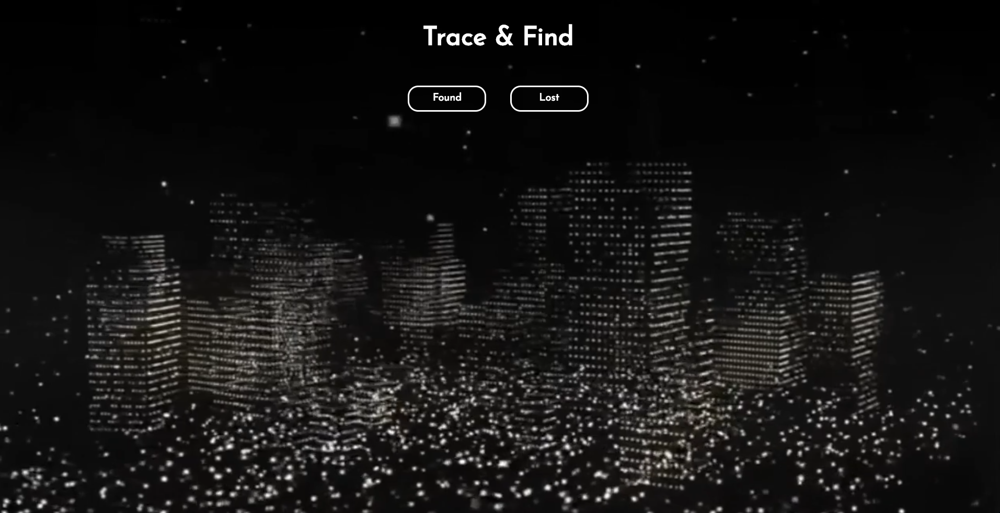
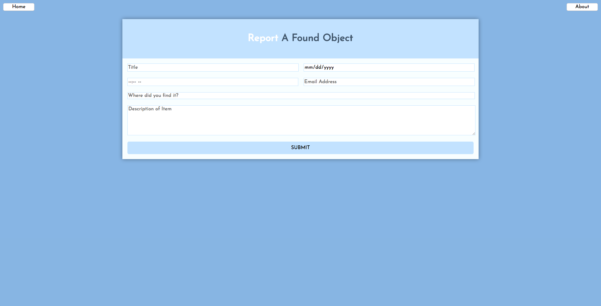
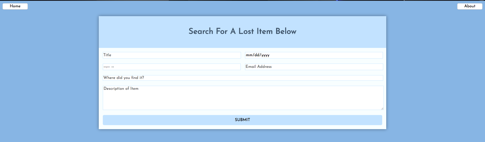
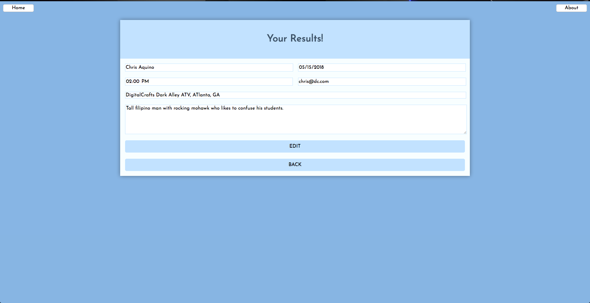
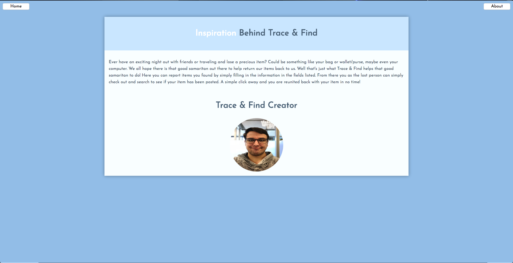
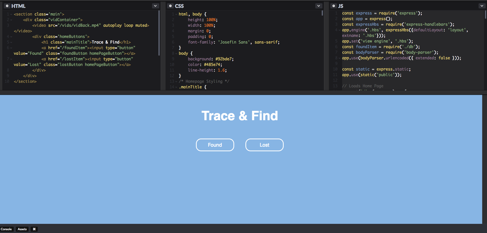

# Trace & Find

## <a href="http://18.222.139.156/"> Live Demo <a>

## Team Members
* <a href="https://github.com/rbrook22"> Rick Brooks </a>

## Technologies Used
* Express-HandleBars
* CSS 3
* JavaScript
* jQuery
* Node.js
* Express
* PostgreSQL

## Team Strategy

Before project week officially kicked off, I already had an idea in mind. I wanted to build a web app that seemed feasible within the scope of time we had to complete it. I got together the day before official kick off and took the time to storyboard a few options for how I wanted the user to interact throughout the process and flow of the app. I then took these stories to build the structure of the site and its pages.

After reviewing the requirements of the project and coming up with an idea,  the next steps were to come up with a plan. I spent the first day laying out our ideas across a whiteboard, sketched out wireframes and discussed the problems I was looking to solve. Some of these included getting input(Found Items) from the user, taking that user input of data and saving that in the database created to call at anytime necessary. I decided to go with bare bones on this project to keep scope of time in mind and just built out the tables necessary for users to post, save, & retrieve the data based on action. We also wanted this app to be web responsive, so we styled based on the ‘mobile first’ design.

Once the creation of the database, SQL Queries, & Route Handling were completed I had just enough time to do some basic styling for the application.

## Site Walkthrough
### Home Page

### Reporting A Found Item Page

### Displaying Lost Items Page

### Search Results Page

### About Page

## Challenges

The difficult piece I found to be throughout the project was understanding the concepts of route handling. Something as simple as app.get & app.post can be a bit lengthier and more complicated when the concept was new.

## Phase 2 Features

Phase 2 feature:
* Adding a login field & user credentials table (for database) allowing users to keep track of their reported items.
* Add in authentication features
* Add additional search filters by: location, description of item, date, etc. 
* Display a map that shows the address based on user entry.
